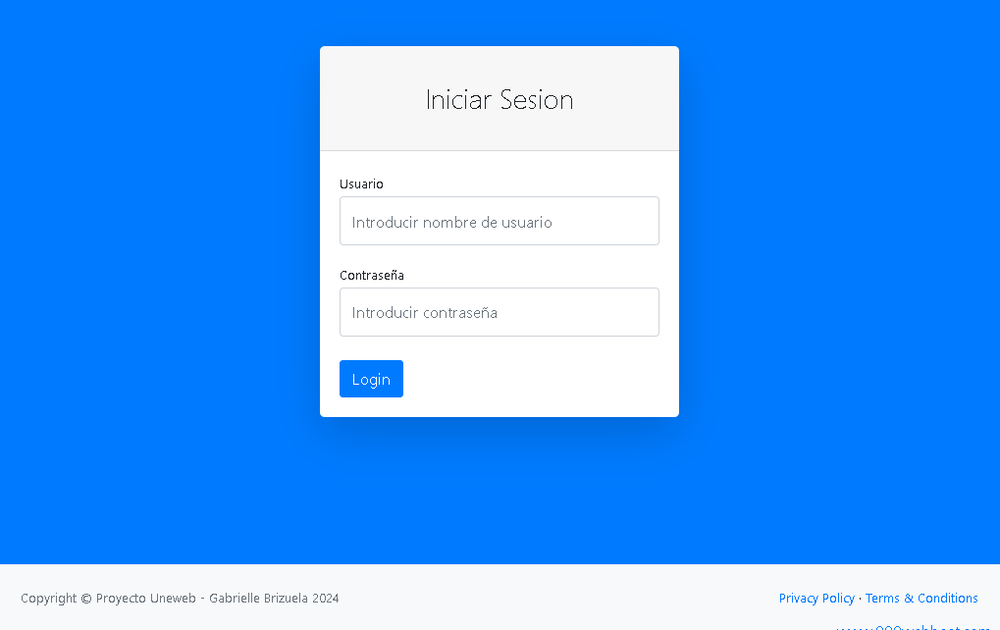

# Sistema de Facturacion

> Sistema de facturacion realizado en php, mysql, javascript y codeigniter.

Additional description about the project and its features.

## Built With

- Major languages: PHP, JavaScript, jquery, AJAX, HTML5, CSS, MySQl.
- Frameworks: CodeIgniter 4
- Technologies used: 000webhost (hosting), Bootstrap, FPDF.

## Live Demo

[Live Demo Link](http://proyectoumc.000webhostapp.com/)

Para ingresar al sistema se coloca en el usuario "admin" y luego la contraseña es "admin01" sin comillas.

## Getting Started

**This is an example of how you may give instructions on setting up your project locally.**
**Modify this file to match your project, remove sections that don't apply. For example: delete the testing section if the currect project doesn't require testing.**

To get a local copy up and running follow these simple example steps.

### Prerequisites

### Setup

### Install

### Usage

### Run tests

### Deployment
http://proyectoumc.000webhostapp.com/

## Authors

👤 **Gabrielle Jesus Brizuela Guacache**

- GitHub: [@GabrielleMrRobot](https://github.com/GabrielleMrRobot)

👤 **Author2**

- GitHub: [@githubhandle](https://github.com/githubhandle)
- Twitter: [@twitterhandle](https://twitter.com/twitterhandle)
- LinkedIn: [LinkedIn](https://linkedin.com/linkedinhandle)

## 🤝 Contributing

Contributions, issues, and feature requests are welcome!

Feel free to check the [issues page](issues/).

## Show your support

Give a ⭐️ if you like this project!

## Acknowledgments

- Hat tip to anyone whose code was used
- Inspiration
- etc

## 📝 License

This project is [CC0 1.0 Universal](LICENSE) licensed.
